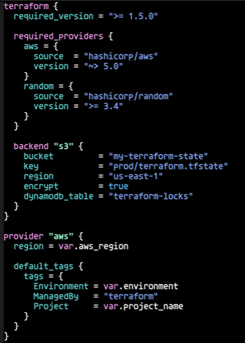
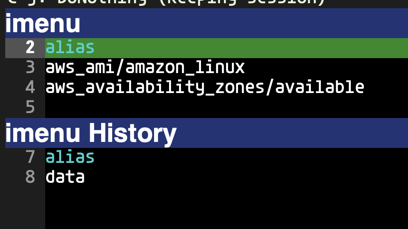

# terraform-mode

A major mode for editing [Terraform](https://www.terraform.io/) and [OpenTofu](https://opentofu.org/) configuration files (`.tf`, `.tfvars`, and `.tofu`).

This is a from-scratch rewrite that removes the dependency on `hcl-mode` and reimplements syntax highlighting using Emacs text properties for context-aware, per-block font-lock.

## Screenshot



#### imenu



## Requirements

- Emacs 30.1+

## Features

- Contextual syntax highlighting
- Indentation
- imenu
- Formatting via `terraform fmt`
- Block folding via `hs-minor-mode`
- Terraform registry documentation access

## Installation

Clone the repository and add it to your load path:

```emacs-lisp
(add-to-list 'load-path "/path/to/terraform-mode")
(require 'terraform-mode)
```

## Syntax Highlighting

Highlighting is contextual: regions are first marked with text properties during `syntax-propertize`, and font-lock matchers filter on those properties. This allows different keywords to be highlighted differently depending on which block they appear in.

Highlighted constructs include:

- Block keywords (`resource`, `data`, `ephemeral`, `variable`, `module`, `output`, `provider`, `terraform`, `locals`, `dynamic`, etc.)
- Block labels (type and name strings)
- Built-in functions (`toset`, `merge`, `lookup`, etc.)
- Reference keywords (`var`, `local`, `module`, `data`, `self`, `ephemeral`)
- Literal constants (`true`, `false`, `null`)
- Assignment targets
- `for` expression keywords and loop variables
- Resource builtins (`for_each`, `count`, `content`, `depends_on`)
- `each.key` / `each.value`
- `lifecycle`, `connection`, `provisioner`, `validation` sub-blocks
- Variable type constraints (`string`, `number`, `bool`, `list`, `set`, `map`, `object`, `any`) and `optional`
- Provider names inside `required_providers`
- Negation operator (`!`)
- Heredoc strings (`<<TERM` and `<<-TERM`), including `${...}` interpolation inside them

## Indentation

Indentation is fixed at 2 spaces, matching the output of `terraform fmt`. It is not configurable.

`<backtab>` unindents the current line or active region by one level.

## Block Folding

`terraform-mode` registers itself with `hs-minor-mode`. To enable block folding, add `hs-minor-mode` to the mode hook:

```emacs-lisp
(add-hook 'terraform-mode-hook #'hs-minor-mode)
```

With `hs-minor-mode` active, use standard hideshow bindings to fold and unfold blocks.

## Formatting

`terraform-mode-format-buffer` and `terraform-mode-format-region` rewrite the buffer or region using `terraform fmt`. Point is preserved across format operations.

To format automatically on save:

```emacs-lisp
(setq terraform-mode-format-on-save t)
```

## Terraform Registry Documentation

Within a `resource`, `data`, or `ephemeral` block:

| Key           | Command                             | Action                                        |
|---------------|-------------------------------------|-----------------------------------------------|
| `C-c C-t C-o` | `terraform-mode-open-doc`           | Open documentation in browser                 |
| `C-c C-t C-c` | `terraform-mode-copy-doc-url`       | Copy documentation URL to clipboard           |
| `C-c C-t C-i` | `terraform-mode-insert-doc-comment` | Insert documentation URL as comment above block |

Provider resolution searches `required_providers` in `.tf` files in the current directory first, then falls back to running `terraform providers`, and finally defaults to `hashicorp/<provider>` if the provider cannot be determined.

## imenu

Block declarations are indexed and grouped by keyword (`resource`, `data`, `ephemeral`, `variable`, `module`, `output`, `provider`). Works with `imenu`, `consult-imenu`, `helm-imenu`, etc.

## Customize Variables

#### `terraform-mode-command` (default: `"terraform"`)

Path or name of the `terraform` executable, used for formatting and provider resolution.

#### `terraform-mode-format-on-save` (default: `nil`)

Set to `t` to automatically format the buffer on save via `terraform fmt`.

## Changes from v1

| Area | v1 | v2 |
|------|----|----|
| Base mode | `hcl-mode` | `prog-mode` (no external dependency) |
| Highlighting | Regexp-based via `hcl-mode` | Context-aware via text properties |
| Indent level | Configurable (`terraform-indent-level`) | Fixed at 2 (aligns with `terraform fmt`) |
| Block folding | `outline-minor-mode` | `hs-minor-mode` |
| Doc keybindings | `C-c C-d C-w/C-c/C-r` | `C-c C-t C-o/C-c/C-i` |
| Symbol prefix | `terraform-` | `terraform-mode-` (public), `terraform-mode--` (private) |
